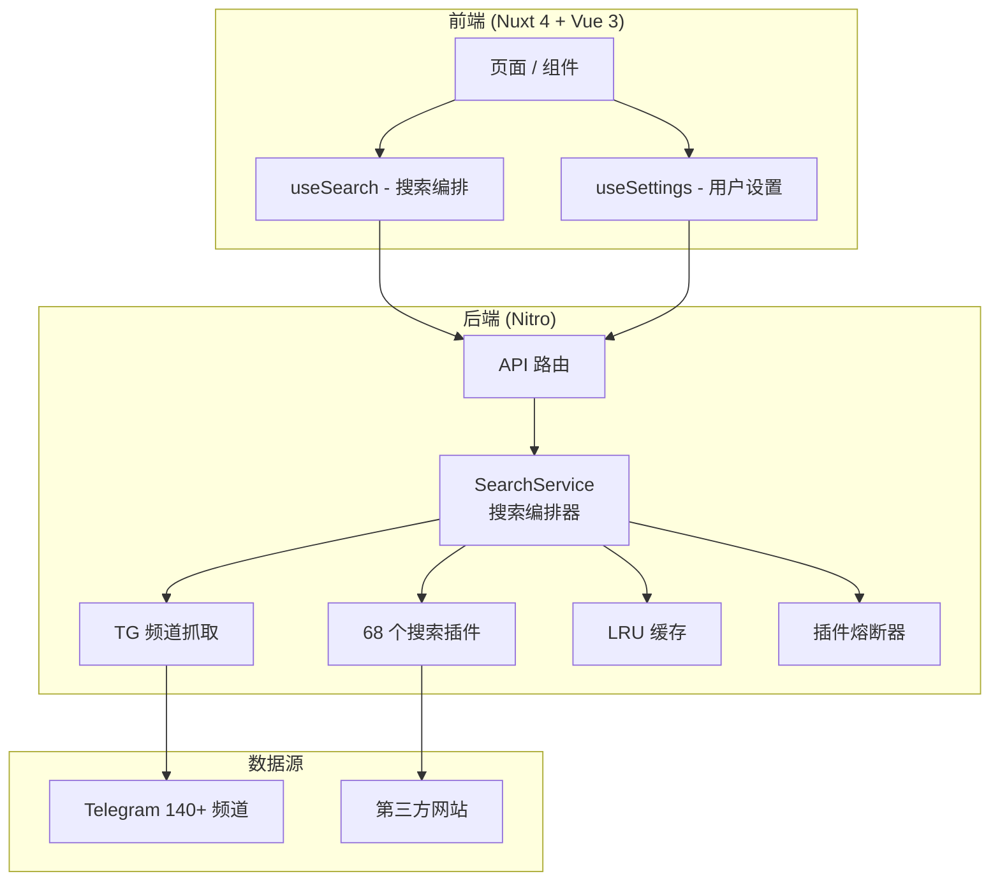

# PanSeek · 全网最全的网盘搜索

> 一个搜索框，搜遍全网网盘资源 —— 即搜即得、聚合去重、免费开源、零广告、轻量部署

[](https://vercel.com/new/clone?repository-url=https%3A%2F%2Fgithub.com%2Fhuanyu-a%2Fpanseek&project-name=panseek&repository-name=panseek)
[](https://deploy.workers.cloudflare.com/?url=https://github.com/huanyu-a/panseek)
[](https://github.com/huanyu-a/panseek/pkgs/container/panseek)
[](LICENSE)

**在线体验**：<https://panhub.shenzjd.com>

---

## ✨ 核心特性

### 🔍 智能搜索

- **多源聚合**：同时搜索 Telegram 140+ 频道 + 68 个第三方插件，覆盖全网公开分享资源
- **优先级调度**：高优先级频道优先返回，首屏结果提速 50%+
- **批量并发**：独立配置并发数（1-16），充分利用网络带宽
- **暂停/继续**：搜索过程可随时暂停，断点续跑不丢结果
- **插件熔断**：失败插件自动降级 5 分钟，避免拖慢整体搜索
- **请求超时取消**：AbortController 真正取消超时请求，不泄漏连接
- **智能缓存**：LRU 淘汰 + 内存监控 + 过期清理
- **网盘类型筛选**：支持按 13 种网盘类型（百度/阿里/夸克/UC/天翼/115/迅雷/移动/PikPak/123/光鸭/磁力/电驴）过滤搜索结果

### 📊 豆瓣影视榜单

- **12 个分类**：Top250、剧情、喜剧、动作、爱情、科幻、动画、悬疑、犯罪、战争、纪录片、电视剧
- **JSON API 驱动**：使用豆瓣内部 API 获取结构化数据，无需解析 HTML（Top250 除外）
- **24 小时缓存**：每个分类一天只请求一次，减少对豆瓣的压力
- **无限滚动**：滚动到底部自动加载更多内容
- **一键搜索**：点击任意影视，自动发起网盘搜索

### 🔗 链接检测助手（油猴脚本）

- **自动检测失效链接**：安装 Tampermonkey 脚本后，搜索结果中的失效链接自动标记删除线
- **零服务器负载**：检测全部在客户端通过 `GM_xmlhttpRequest` 完成
- **平台适配**：夸克、阿里、百度、115、迅雷等各平台分别检测
- **30 分钟缓存**：同一链接不重复检测

### 🔥 热门搜索

- **实时热搜**：展示其他用户搜索词，点击即可搜索
- **数据持久化**：SQLite 存储（Docker/本地）+ 内存降级（Serverless）
- **搜索统计**：实时展示热搜榜使用次数

### 🎨 用户体验

- **深色模式**：完整支持深色主题，自动跟随系统偏好
- **响应式设计**：适配桌面、平板、手机
- **密码门**：可配置 `SEARCH_PASSWORD`，密码爆破防护（5 次失败锁定）
- **优雅降级**：单个插件/频道失败不影响整体

### 🛡️ 安全与稳定性

- **限流防护**：API 路由限流 + unlock 密码爆破防护
- **SSRF 防护**：图片代理白名单 + URL 严格校验
- **输入校验**：关键词长度限制、并发数范围校验
- **错误处理**：统一的 `createError` 错误响应
- **125+ 测试用例**：核心逻辑全覆盖

---

## 🚀 快速开始

### 方式一：Vercel 一键部署（推荐）

[](https://vercel.com/new/clone?repository-url=https%3A%2F%2Fgithub.com%2Fhuanyu-a%2Fpanseek&project-name=panseek&repository-name=panseek)

### 方式二：Cloudflare Workers 一键部署

[](https://deploy.workers.cloudflare.com/?url=https://github.com/huanyu-a/panseek)

### 方式三：Docker 部署

```bash
# 快速启动
docker run --name panseek -p 4000:4000 -d ghcr.io/huanyu-a/panseek:latest

# 数据持久化（推荐）
mkdir -p /root/panseek/data
docker run -d --name panseek -p 4000:4000 \
  -v /root/panseek/data:/app/data \
  ghcr.io/huanyu-a/panseek:latest
```

或使用 docker-compose：

```bash
docker compose up -d
```

### 方式四：本地开发

```bash
# 安装依赖
pnpm install

# 启动开发服务器（默认端口 4000）
pnpm dev

# 运行测试
pnpm test

# 构建生产版本
pnpm build

# 预览生产构建
pnpm preview
```

---

## 📖 使用指南

### 搜索流程

1. **输入关键词并回车**开始搜索
2. **快速结果**：优先频道先返回（~50ms）
3. **深度结果**：剩余频道继续加载
4. **自动合并**：结果去重、按时间排序、分类型展示

### 设置面板

右上角设置按钮可配置：

- **插件来源**：启用/禁用 68 个第三方搜索插件
- **频道来源**：配置 Telegram 频道列表（140+ 频道可选）
- **网盘类型**：按 13 种网盘类型筛选搜索结果（百度/阿里/夸克/UC/天翼/115/迅雷/移动/PikPak/123/光鸭/磁力/电驴）
- **性能参数**：并发数（1-16）、超时时间（1000-60000ms）

### 链接检测助手

1. 安装 [Tampermonkey](https://www.tampermonkey.net/) 浏览器扩展
2. 访问 [链接检测助手安装页](https://panhub.shenzjd.com/panseek-link-checker.user.js)
3. 点击安装，刷新 PanSeek 页面即可生效

安装后搜索结果中的失效链接会自动标记 ~~删除线~~ + 红色"可能失效"标签。

---

## ⚙️ 环境变量

| 变量名 | 默认值 | 说明 |
|--------|--------|------|
| `LOG_LEVEL` | `info` | 日志级别（debug/info/warn/error） |
| `NITRO_PRESET` | auto-detect | 部署预设（`vercel` / `cloudflare` / `node-server`） |
| `PORT` | `4000` | 服务端口 |
| `SEARCH_PASSWORD` | 空 | 非空时启用密码门，搜索时需输入密码（5 次失败锁定 5 分钟） |

### 部署差异说明

| 特性 | Docker/Node | CF Workers / Vercel |
|------|-------------|---------------------|
| 进程内缓存 | ✅ 持久 | ❌ 每个 isolate 独立 |
| 热搜数据持久化 | ✅ SQLite | ❌ 仅内存（重启丢失） |
| 插件健康状态 | ✅ 持久 | ❌ 每次冷启动重置 |
| 链接检测助手 | ✅ | ✅（需 Tampermonkey） |

---

## 🏗️ 技术架构



### 前端技术栈

- **框架**：Nuxt 4 + Vue 3
- **样式**：原生 CSS（无框架依赖）
- **状态管理**：Vue Composition API（`useSearch` / `useSettings`）
- **类型安全**：TypeScript
- **并发控制**：p-limit（前端任务并发）

### 后端技术栈

- **运行时**：Nitro（Nuxt 内置）
- **HTML 解析**：Cheerio（TG 频道 + 插件爬虫）
- **HTTP 客户端**：ofetch
- **并发控制**：p-limit
- **数据库**：sql.js（SQLite WASM，热搜持久化）
- **测试框架**：Vitest

---

## 📦 支持的网盘平台

| 平台 | 类型标识 | 说明 |
|------|---------|------|
| 百度网盘 | `baidu` | `pan.baidu.com` |
| 阿里云盘 | `aliyun` | `alipan.com` / `aliyundrive.com` |
| 夸克网盘 | `quark` | `pan.quark.cn` |
| UC网盘 | `uc` | `drive.uc.cn` |
| 天翼云盘 | `tianyi` | `cloud.189.cn` |
| 115网盘 | `115` | `115.com` / `115cdn.com` / `anxia.com` |
| 迅雷云盘 | `xunlei` | `pan.xunlei.com` |
| 移动云盘 | `mobile` | `caiyun.139.com` / `yun.139.com` |
| PikPak | `pikpak` | `mypikpak.com` |
| 123网盘 | `123` | `123pan.com` 等多域名 |
| 光鸭云盘 | `guangya` | `guangyapan.com` |
| 磁力链接 | `magnet` | `magnet:?xt=urn:btih:` |
| 电驴链接 | `ed2k` | `ed2k://` |

---

## 🧩 搜索插件

当前内置 68 个活跃搜索插件，覆盖影视、动漫、游戏、软件等资源类型。插件按优先级分为三档：

- **高优先级（22 个）**：`pansearch`、`nyaa`、`susu`、`wanou`、`labi`、`lou1`、`panyq`、`ouge`、`huban`、`yunsou` 等 — 快速返回高质量结果
- **标准优先级（43 个）**：`pan666`、`hunhepan`、`kkv`、`javdb`、`zxzj` 等 — 补充覆盖更多资源
- **低优先级（3 个）**：`1337x`、`solidtorrents`、`u3c3` — 磁力/种子类，耗时较长

插件系统支持热插拔，新增插件只需在 `server/core/plugins/` 下创建文件并在 `registerAllPlugins.ts` 中注册。

---

## 🤝 贡献指南

欢迎提交 Issue 和 Pull Request！

1. Fork 本仓库
2. 创建功能分支：`git checkout -b feat/your-feature`
3. 提交更改，遵循 [Conventional Commits](https://www.conventionalcommits.org/)（`feat:`、`fix:`、`refactor:` 等）
4. 提交前运行 `pnpm test` 确保测试通过
5. 发起 Pull Request，附上变更说明和测试证据

### 开发规范

- 使用 TypeScript 编写
- Vue composables 命名：`useXxx.ts`
- Server 路由命名：`name.get.ts` / `name.post.ts`
- 单元测试：`*.test.ts` 置于 `test/unit/`
- 缩进 2 空格，保持双引号和分号一致

---

## 📄 许可证

[MIT License](LICENSE)

---

## 🙏 鸣谢

- [Nuxt.js](https://nuxt.com/) — 渐进式 Vue 框架
- [Nitro](https://nitro.unjs.io/) — Web 服务器工具包
- [Cheerio](https://cheerio.js.org/) — HTML 解析器
- [p-limit](https://github.com/sindresorhus/p-limit) — 并发控制
- [sql.js](https://github.com/sql-js/sql.js/) — SQLite WASM
- [Vitest](https://vitest.dev/) — 测试框架
- [PanSou](https://github.com/pansou/pansou) — 搜索插件参考实现

---

**⭐ 如果觉得有用，请给个 Star 支持一下！**

**在线体验**：<https://panhub.shenzjd.com>
